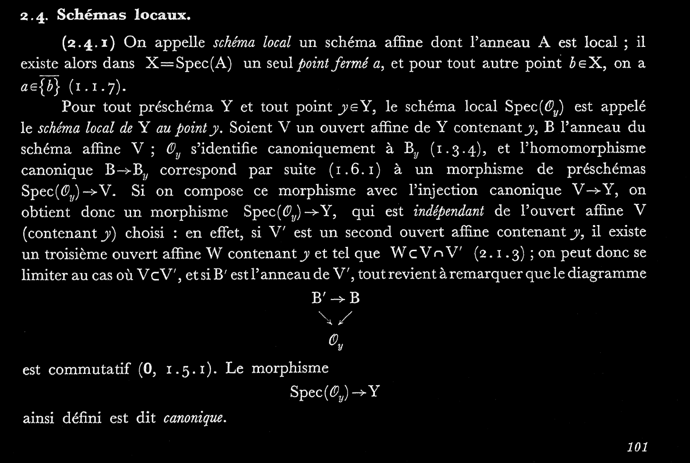

# `EGAI.lean`

## (2.4.1)

This file formalised EGAI 2.4.1


We mainly follow the approach described above but with more a bit more precision.

---

If $Y$ is a scheme and $y\in Y$, $\operatorname{Spec}(\mathcal{O}_{Y, y})$ is the local scheme of $Y$ at $y$. If $V$ is an affine open subset of $Y$ containing $y$ then there is a canonical morphism $\Gamma(Y\mid_ V)\to\mathcal{O}_{Y\mid_ V, y}\cong \mathcal{O}_{Y, y}$ by means of germs:

```lean
def sections_to_stalk_restrict_aux
  {V : opens Y.carrier} (hV : is_affine_open V) (mem_ : y ∈ V) : 
  Γ.obj (op $ Y.restrict V.open_embedding) ⟶ 
  (Y.restrict V.open_embedding).stalk ⟨y, mem_⟩ :=
Top.presheaf.germ (Y.restrict V.open_embedding).presheaf 
  ⟨⟨y, mem_⟩, by tauto⟩

def sections_to_stalk_restrict
  {V : opens Y.carrier} (hV : is_affine_open V) (mem_ : y ∈ V) : 
  Γ.obj (op $ Y.restrict V.open_embedding) ⟶ Y.stalk y :=
sections_to_stalk_restrict_aux hV mem_ ≫ 
(Y.1.to_PresheafedSpace.restrict_stalk_iso _ _).hom
```

Thus, we have a morphism $\operatorname{Spec}\mathcal{O}_{Y, y}\to \operatorname{Spec} \Gamma(Y\mid_ V)\cong Y\mid_ V\hookrightarrow Y$.

```lean
def Spec_stalk_to_restrict
  {V : opens Y.carrier} (hV : is_affine_open V) (mem_ : y ∈ V) :
  (Spec_obj $ Y.stalk y) ⟶ Y.restrict V.open_embedding :=
Spec_map (sections_to_stalk_restrict hV mem_) ≫ hV.iso_Spec.inv
```

---

Note that this definition dependends on the choice of affine open subset $V$. To prove the canonicity of this morphism, it needs to be shown that if $V, W$ are two affine open subsets containing $y$, then the following diagram commutes:

<center>

```latex{latex_zoom=2, cmd=true, hide=true}
\documentclass{standalone}
\usepackage{tikz-cd}
\usepackage{amsmath, amsfonts}
\begin{document}
\begin{tikzcd}
{\operatorname{Spec} \mathcal{O}_y} \ar[r] \ar[d] & 
    Y\mid_ V \ar[d, hook] \\
Y\mid_ W \ar[r, hook] & Y
\end{tikzcd}
\end{document}
```

CD-1 : commutative square
</center>

----

We first prove this in the case of $V \le W$. Then we have a morphism of Scheme (also as locally ringed space and presheafed space) $Y\mid_ V \to Y\mid_ U$ given by $\Phi=(\phi, \phi^\#)$ where $\phi: V \hookrightarrow W$ is the inclusion and $\phi^\#: \mathcal{O}_{Y\mid_ V}\to \phi_*\mathcal{O}_{Y\mid_ U}$ is given by restriction map of structure sheaf of $Y$; this locally ringed space morphism makes the following triangle commutes:

<center>

```latex {cmd=true, latex-zoom=2, hide=true, id="comm_triangle"}
\documentclass{standalone}
\usepackage{tikz-cd}
\usepackage{amsmath, amsfonts}
\begin{document}
\begin{tikzcd}
Y\mid_ W \ar[r, hook] & Y \\
Y\mid_ V \ar[u, hook, "{\Phi}"] \ar[ru, hook]
\end{tikzcd}
\end{document}
```

CD-2: commutative triangle
</center>

```lean
@[simps] def restrict_of_subset_rel'_PresheafedSpace (subset_rel : V ≤ W) :
  (Y.restrict V.open_embedding).to_PresheafedSpace ⟶ 
  (Y.restrict W.open_embedding).to_PresheafedSpace :=
{ base := ⟨λ y, ⟨y.1, subset_rel y.2⟩, by continuity⟩,
  c := 
  { app := λ U, Y.presheaf.map (hom_of_le 
    begin 
      rintros _ ⟨y, hy, rfl⟩,
      erw set.mem_preimage at hy,
      refine ⟨⟨_, subset_rel y.2⟩, hy, rfl⟩,
    end : V.open_embedding.is_open_map.functor.obj _ ⟶ W.open_embedding.is_open_map.functor.obj _).op,
    naturality' := λ U V inc, 
    begin 
      erw [←Y.presheaf.map_comp, ←Y.presheaf.map_comp],
      congr,
    end } }

def restrict_of_subset_rel' (subset_rel : V ≤ W) :
  Y.restrict V.open_embedding ⟶ Y.restrict W.open_embedding :=
{ val := restrict_of_subset_rel'_PresheafedSpace subset_rel,
  prop := infer_instance }
```

Note that this is a morphism between presheafed space, so it still needs to be shown that $\Phi$ induces a local ring homomorphism on stalks everywhere. Instead of computing the induced local ring directly, we verify that $\Phi$ is equals to the morphism obtained via `is_open_immersion.lift`[^1]; since the morphism from `is_open_immersion.lift` is a morphism of scheme, it induces local ring homomorphism on stalks.

[^1]:  The universal property of open immersions:
For an open immersion $f : X ⟶ Z$, given any morphism of schemes $g : Y ⟶ Z$ whose topological
image is contained in the image of $f$, we can lift this morphism to a unique $Y ⟶ X$ that
commutes with these maps.

---

We also have a ring homomorphism $\Gamma(Y\mid_ V)\to \Gamma(Y\mid_ W)$ given by $\Gamma(\Phi)$. Apply the $\Gamma$ functor to CD-2, we get

<center>

```latex{cmd=true, latex_zoom=2, hide=true}
\documentclass{standalone}
\usepackage{tikz-cd}
\usepackage{amsmath, amsfonts}
\begin{document}
\begin{tikzcd}
\Gamma(Y\mid_ W) \ar[r] & \Gamma(Y) \ar[r] & Y_{y}\\
\Gamma(Y\mid_ V) \ar[u, "{\Gamma(\Phi)}"] \ar[ru] &
\end{tikzcd}
\end{document}
```
</center>

Then we apply $\operatorname{Spec}$ functor again to obtain


<center>

```latex{cmd=true, latex_zoom=2, hide=true}
\documentclass{standalone}
\usepackage{tikz-cd}
\usepackage{amsmath, amsfonts}
\begin{document}
\begin{tikzcd}
\operatorname{Spec} Y_y \ar[r] \ar[d] & Y\mid_ W \ar[r, hook] & Y  \\
Y\mid_ V \ar[ru, hook]
\end{tikzcd}
\end{document}
```
</center>


```lean
def ring_hom_of_subset 
  (subset_rel : V ≤ W) :
  Γ.obj (op $ Y.restrict W.open_embedding) ⟶ Γ.obj (op $ Y.restrict V.open_embedding) :=
Γ.map (restrict_of_subset_rel' subset_rel).op

lemma commutes (subset_rel : V ≤ W) (mem_ : y ∈ V) :
  ring_hom_of_subset subset_rel ≫ sections_to_stalk_restrict hV mem_ = 
  sections_to_stalk_restrict hW (subset_rel mem_) := 
sorry

lemma commutes' (subset_rel : V ≤ W) (mem_ : y ∈ V) :
  Spec_stalk_to_restrict hW (subset_rel mem_) = 
  Spec_stalk_to_restrict hV mem_ ≫ 
  restrict_of_subset_rel' subset_rel :=
sorry

lemma independent_aux (subset_rel : V ≤ W) (mem_V : y ∈ V) :
  Spec_stalk_to_restrict hW (subset_rel mem_V) ≫ Y.of_restrict W.open_embedding = 
  Spec_stalk_to_restrict hV mem_V ≫ Y.of_restrict V.open_embedding :=
by rw [commutes' hV, category.assoc, restrict_of_subset_rel'_comp]

```

For general cases, we just pick an affine open $W \subseteq V \cap W$.
